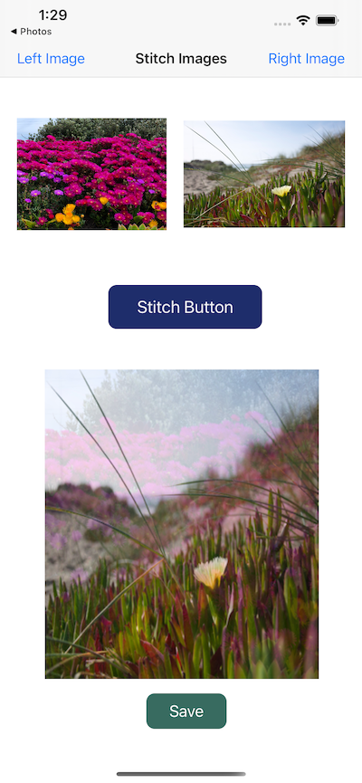

# Stitch-two-images
An iOS App to Stitch two images together from the UIPickerImage


## How to Use 
Download or clone this repo by using the link below:

```
https://github.com/binemugha/Stitch-two-images.git
```

##  App feature
- User is able to select two images and merge them.
- User is able to view the merged image.
- User is able to save the merged image locally


## Up-coming features
- User will able to select multiple images and merge.
- User will be able to select the blend opacity and direction.


## Walkthrough



